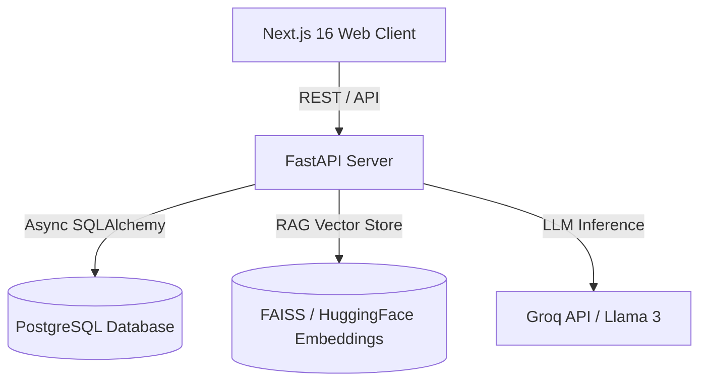

# ResumeMatch AI - System Architecture Blueprint

## System Overview
ResumeMatch AI is an enterprise-grade AI-powered platform for resume optimization, ATS compatibility scoring, RAG-based job description alignment, and custom interview preparation.

## Architectural Layers
1. **Frontend**: Next.js 16 App Router, React 19, TypeScript, Tailwind CSS, TanStack Query.
2. **Backend**: FastAPI, Pydantic v2 Settings, SQLAlchemy 2.0 Async, Structlog.
3. **Database**: PostgreSQL 16 with pg_trgm & uuid extensions.
4. **AI Pipeline (Future Phases)**: LangChain, FAISS, HuggingFace embeddings, Groq API.

## API Versioning
All backend APIs are routed under `/api/v1/`. Health check is exposed at `/api/v1/health`.
